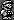

# FiT
Simulation and implementation of the FiT (Fidelity Threshold) Link layer quantum communication protocol.  A communication link between Alice and Bob is established to enable the distribution of quantum frames containing entanglement or superdense coded information. The distributed entanglement satisfies a minimal threshold fidelity.  

